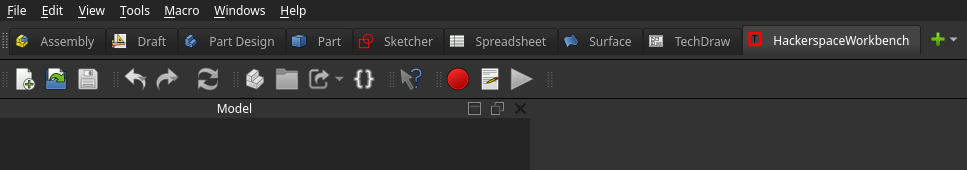
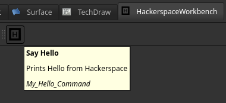
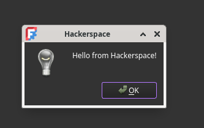

# HackerspaceWorkbench
External workbenches in FreeCAD add extra tools for specific tasks.


**Toolbar**




**Tooltip**




**Popup**




**Prerequisites**

 - Install FreeCAD (>=0.20)

 - Install Python3 and Git

 - Know basics of Python and FreeCAD API (especially Part, Gui, App modules)


**Setup Directory Structure**


```
cnc@debian:~/Desktop/MY_GIT/HackerspaceWorkbench$ tree
.
├── HackerspaceWorkbench
│   ├── CMakeLists.txt
│   ├── docs
│   │   ├── commands.md
│   │   └── HISTORICAL_README.md
│   ├── freecad
│   │   └── hacker_space_workbench
│   │       ├── init_gui.py
│   │       ├── __init__.py
│   │       ├── my_numpy_function.py
│   │       ├── __pycache__
│   │       │   ├── __init__.cpython-311.pyc
│   │       │   ├── init_gui.cpython-311.pyc
│   │       │   └── my_numpy_function.cpython-311.pyc
│   │       ├── resources
│   │       │   ├── cool.png
│   │       │   ├── cool.svg
│   │       │   ├── cool.svg.bakup
│   │       │   ├── icons
│   │       │   ├── translations
│   │       │   │   ├── hacker_space_workbench_es-ES.ts
│   │       │   │   ├── README.md
│   │       │   │   └── update_translation.sh
│   │       │   └── ui
│   │       └── version.py
│   ├── LICENSE
│   ├── MANIFEST.in
│   ├── pyproject.toml
│   ├── README.md
│   └── setup.py
├── img
│   └── WB.png
└── README.md

11 directories, 23 files

```


**Mod directory**


```

App.getUserAppDataDir() in the Python console)


>>> App.getUserAppDataDir()
'/home/cnc/.local/share/FreeCAD/'


Paste the repository into this location:

/home/cnc/.local/share/FreeCAD/Mod/


```


**Use this command to create the symlink:**

```
ln -s /home/cnc/Desktop/MY_GIT/HackerspaceWorkbench/HackerspaceWorkbench /home/cnc/.local/share/FreeCAD/Mod/HackerspaceWorkbench


rm /home/cnc/.local/share/FreeCAD/Mod/HackerspaceWorkbench

```


**Todo**


**Use FreeCAD AppImage as SDK**

```
./FreeCAD*.AppImage --appimage-extract


This creates a folder: squashfs-root/
```


**help**


```

https://github.com/FreeCAD/freecad.workbench_starterkit

https://github.com/FreeCAD/FreeCAD-addons/tree/master
```


The `libfmt-dev` package provides the [fmt](https://fmt.dev/) library, a **modern C++ formatting library** used as a safer, faster alternative to `printf` and `std::cout`.

📌 **Purpose in FreeCAD:**

* Used for formatted logging/output (e.g., in `Console.h`).
* Replaces `printf`-style functions with type-safe, efficient formatting like:

  ```cpp
  fmt::print("Value: {}\n", 42);
  ```
  
It's a required dependency when compiling C++ code in FreeCAD that includes formatted console output.

